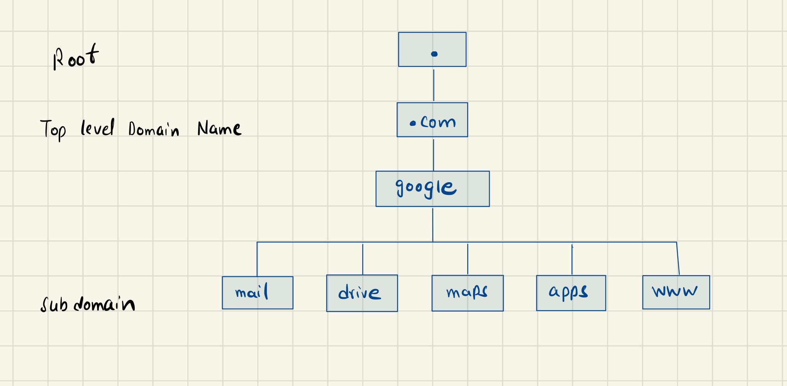

# DNS

 In linux you can put the host name with the maping of it's ip like:

  ```bash
    # cat >> /etc/hosts
    192.168.1.11  db
    192.168.1.11  www.google.com
  ```
Now if you ping from system A to B which was db `ping db` it will work. 

Here the system will not verify it though. Translating host name from the IP is called **Name Resolution**

This is ok for couple of hosts, what if the hosts will increase then offcourse this list will also increase and it is hard to maintiain it.

As a solution we migrate this whole list to a dedicated server called **DNS**. And now we configure each host to refer this DNS in order to resolve the address.

### Configuring your host for a particular DNS

For refering to a particular DNS you have follow this:

```bash
  # cat /ect/resolve.conf
  nameserver     192.168.1.100
```

Even though you have the entry on the DNS server you can still have the same into your `/etc/hosts` and in this case when the entry is in both place by default it will first
check it locally and then the DNS.

But this order can be change like

```bash
  # cat /etc/nsswitch.conf
  hosts:     files dns
```

 You can also add public name server in your `/etc/resolv.conf` file for example
 ```bash
  # google nameserver
  nameserver    8.8.8.8 
```

## Domain Names



---

For example if you want to have inside the company they just use `web` and it should be resolve to `web.mycompany.com` to do this you can add this:
```bash
  # cat >> /etc/resolv.conf
  search     mycompany.com   prod.mycompany.com
```


## Record Types
It's the way the DNS keeps the records and then on the basis of that it is called either A record types or...
|        |                 |                                         |
|--------|-----------------|-----------------------------------------|
| A      | web-server      | 192.168.1.11                            |  # ipv4
| AAAA   | web-server      | 2001:0dsg:00ds:dsid:0000:0000:ds32:32gf |  # ipv6
| CNAME  | food.web-server | eat.web-server, hungury.web-server      |  # name

---

**nslookup**: You can use it to query the address

`nslookup www.google.com`

Note: If you add an entry locally in the `/etc/hosts` this nslookup will not work there. It only lookup the DNS.

The another option is `dig`.

`dig www.google.com`


---
# Core DNS
Let's see how to configure a host as a DNS server.

We are given a server dedicated as the DNS server, and a set of Ips to configure as entries in the server. There are many DNS server solution out there, here we gonna focus on **CoreDNS**

CoreDNS binaries can be downloaded from their Github release page or as a docker image. Let's go the traditional route. Download the binary using curl or wget. And extract it. You get the coredns executable.

- `wget https://....`

- `tar -xzvf coredns_1.4.0_linux_amd64.tgz`

- `./coredns`

Run the executable to start a DNS server. It by default listens on port 53, which is the default port for a DNS server.

Now we haven't specified the IP to hostname mappings. For that you need to provide some configurations. There are multiple ways to do that. We will look at one. first we put all of the entreis into the DNS servers `/etc/host` file.

And then we configure CoreDNS to use that file. CoreDNS loads it's configuration from a file named Corefile. Here is a simple configuration that instructs CoreDNS to fetch the IP to hostname mappings from the file `/etc/hosts`. When the DNS server is run, it now picks the Ips and names from the `/erc/hosts` file on the server.

```bash
  # cat > Corefile
  {
    hosts /etc/hosts
  }
```

 CoreDNS also supports other ways of configuring DNS entries through plugins. We will look at the plugin that it uses for Kubernetes late.


Read more about CoreDNS here:

[https://github.com/kubernetes/dns/blob/master/docs/specification.md](https://github.com/kubernetes/dns/blob/master/docs/specification.md)

[https://coredns.io/plugins/kubernetes/](https://coredns.io/plugins/kubernetes/)


